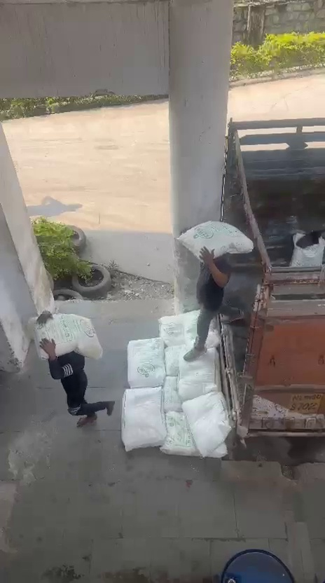
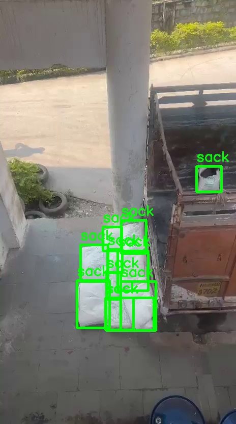

# Auto-Labeling Pipeline with SAM-3 & YOLOX

This project provides a complete pipeline for automating dataset labeling using the **Segment Anything Model 3 (SAM-3)** and training object detection models with **YOLOX**. It includes a user-friendly **Streamlit** application for easy interaction.

## Workflow Demo

Here is an example of the auto-labeling process using SAM-3:

| **Raw Input** | **Auto-Labeled Output** |
|:---:|:---:|
|  |  |
| *Original frame extracted from video* | *Bounding boxes generated by SAM-3* |

## Features

*   **Auto-Labeling**: Uses SAM-3 with text prompts (e.g., "sack", "person") to automatically generate segmentation masks and convert them to YOLO-format bounding boxes.
*   **Video Processing**: Extracts frames from video files for dataset creation.
*   **Streamlit App**: A GUI to upload videos/images, configure classes, run the pipeline, and visualize results.
*   **Dataset Management**: Tools to merge datasets from multiple sources (e.g., Roboflow, local videos) and handle file naming collisions.
*   **YOLOX Integration**: Ready for training YOLOX models on the generated dataset.

## Installation

1.  **Clone the repository**:
    ```bash
    git clone https://github.com/yourusername/your-repo.git
    cd your-repo
    ```

2.  **Create a virtual environment**:
    ```bash
    python3 -m venv .venv
    source .venv/bin/activate
    ```

3.  **Install dependencies**:
    ```bash
    pip install -r requirements.txt
    ```

4.  **Install SAM-3**:
    SAM-3 needs to be installed from source:
    ```bash
    pip install git+https://github.com/facebookresearch/sam3.git
    ```

## Usage

### 1. Streamlit App (Recommended)
The easiest way to use the tool is via the web interface.

```bash
streamlit run app.py
```
*   **Upload**: Drag & drop your video or images.
*   **Configure**: Enter class names (e.g., `sack, person`).
*   **Process**: Click "Start Processing".
*   **Download**: Download the labeled dataset as a ZIP file.

### 2. Command Line Interface

**Auto-Labeling**:
```bash
python auto_label.py --images path/to/images --output path/to/save/labels
```

**Video to Frames**:
```bash
python video_to_frames.py path/to/video.mp4 --output_dir dataset_raw/images --every_n 5
```

**Merge Datasets**:
```bash
python merge_datasets.py --source dataset_roboflow --dest datasets/final_dataset --split train
```

## Dataset Structure

The pipeline produces datasets in standard **YOLOv8** format:

```
dataset/
├── images/
│   ├── train/
│   └── val/
├── labels/
│   ├── train/
│   └── val/
└── data.yaml
```

## Credits

*   [Segment Anything Model 3 (SAM-3)](https://github.com/facebookresearch/sam3)
*   [YOLOX](https://github.com/Megvii-BaseDetection/YOLOX)
*   [Streamlit](https://streamlit.io/)
